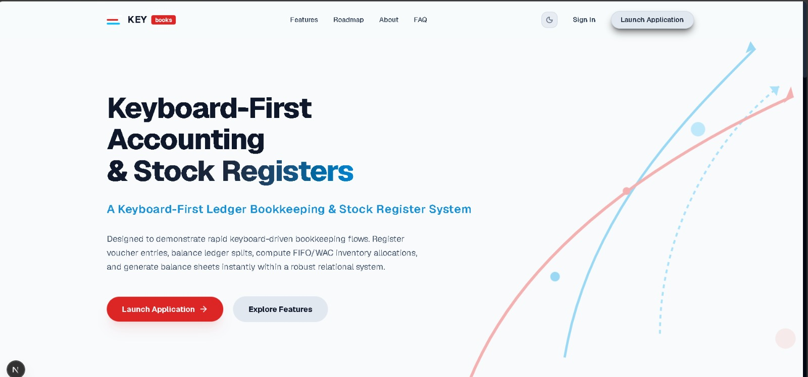
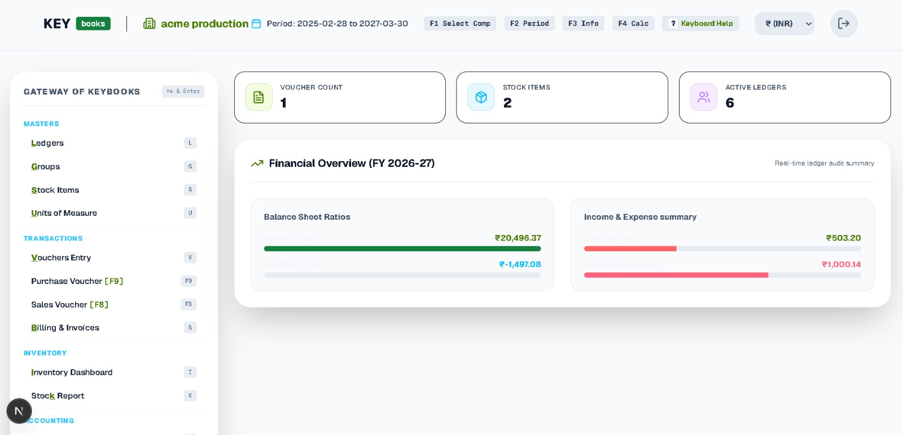
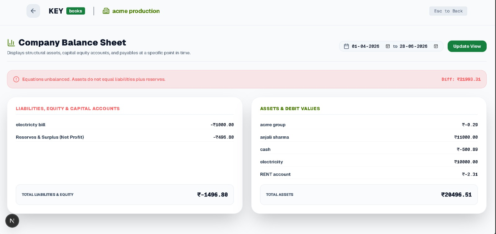
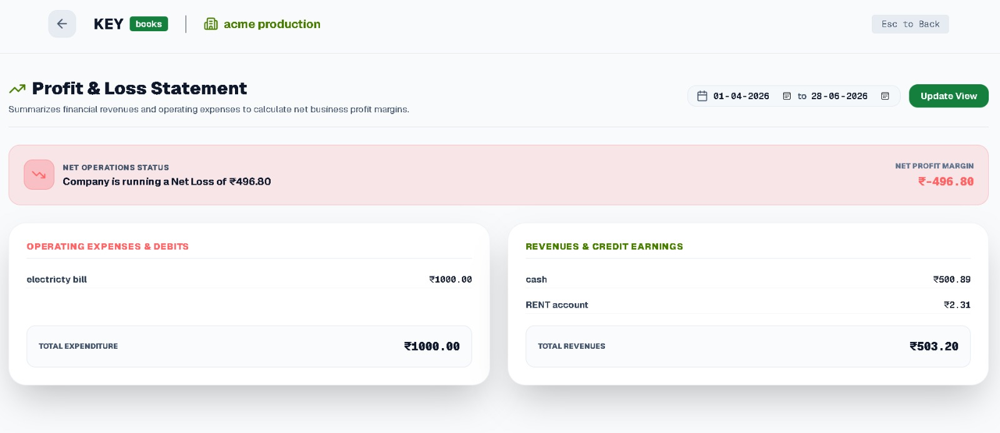

# SmartERP (KEYbooks)

SmartERP is a keyboard-first ERP and accounting platform built for fast daily bookkeeping workflows.  
It combines double-entry accounting, inventory tracking, billing, and financial reporting in a modern web app.

## Highlights

- Keyboard-driven workflow inspired by desktop accounting tools
- Double-entry vouchers (sales, purchase, payment, receipt)
- Ledger, groups, units, stock groups, stock items, and customer masters
- Billing/invoice flows with configurable invoice settings
- Real-time financial reports (Trial Balance, P&L, Balance Sheet, Day Book, Cash/Bank, Stock Summary)
- Multi-company support with role-based access
- Email verification and password reset flows
- Concurrency lock checks for critical business operations

## Tech Stack

### Frontend
- Next.js (App Router) + React + TypeScript
- Tailwind CSS
- ESLint

### Backend
- Node.js + Express
- PostgreSQL (`pg`)
- JWT auth with HTTP-only cookies
- Nodemailer for email delivery (with development fallback logging)
- Security middleware: Helmet, CORS policy, rate limiter

## Repository Structure

```text
SmartERP/
├── backend/
│   ├── config/          # DB + mail configuration
│   ├── controllers/     # Route handlers
│   ├── Middleware/      # Auth, lock, rate limit middleware
│   ├── migrations/      # DB migration scripts
│   ├── models/          # Data-access layer
│   ├── routes/          # API route definitions
│   ├── tests/           # Integration scripts
│   └── server.js        # Express app entrypoint
└── frontend/
    ├── src/app/         # Next.js routes and UI modules
    ├── src/assets/      # README screenshots
    └── public/          # Static assets
```

## Prerequisites

- Node.js 18+
- PostgreSQL 14+
- npm

## Quick Start

### 1) Clone and install

```bash
git clone https://github.com/antrasharma15/SmartERP.git
cd SmartERP

cd backend && npm install
cd ../frontend && npm install
```

### 2) Configure backend environment

Create `backend/.env`:

```env
DATABASE_URL=******HOST:5432/DATABASE
PORT=5000
NODE_ENV=development
JWT_SECRET=replace_with_strong_secret
FRONTEND_URL=http://localhost:3000

SMTP_HOST=
SMTP_PORT=587
SMTP_SECURE=false
SMTP_USER=
SMTP_PASS=
SMTP_FROM="KEYbooks Security <security@myKEYbooks.com>"
```

> If SMTP values are not provided, backend mail calls are logged to console in development mode.

### 3) Run the app

In terminal 1:

```bash
cd backend
npm run dev
```

In terminal 2:

```bash
cd frontend
npm run dev
```

- Frontend: http://localhost:3000
- Backend: http://localhost:5000

## Scripts

### Backend (`/backend`)
- `npm run dev` — start with nodemon
- `npm start` — start with node

### Frontend (`/frontend`)
- `npm run dev` — Next.js dev server
- `npm run build` — production build
- `npm run start` — run production build
- `npm run lint` — run ESLint

## API Overview

Base URL: `http://localhost:5000/api`

Main route groups:

- `/auth`
- `/companies`
- `/ledgers`
- `/groups`
- `/units`
- `/stock-groups`
- `/stock-items`
- `/vouchers`
- `/customers`
- `/invoices`
- `/reports`
- `/settings`

Most business routes require authentication and pass through lock checks.

## Testing

Backend includes integration-style test scripts in `/backend/tests`.  
Run them against a running local backend instance, for example:

```bash
cd backend
node tests/authIntegration.js
```

## Screenshots

### Landing


### Registration


### Dashboard


### Balance Sheet


### Profit & Loss


## Current Focus / Roadmap

- GST workflows and compliance exports
- Bank reconciliation improvements
- Cheque management
- Better invoice template customization

## Contributing

1. Fork the repository
2. Create a feature branch
3. Commit your changes
4. Open a pull request

## Author

- Antra Sharma  
  GitHub: [@antrasharma15](https://github.com/antrasharma15)
