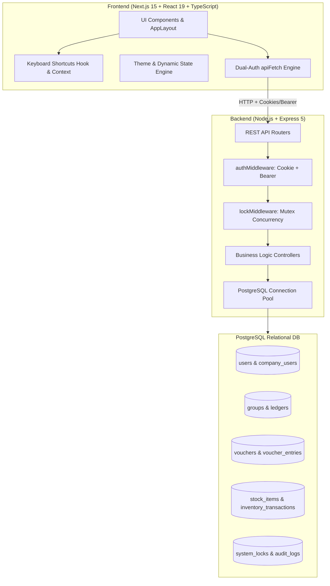
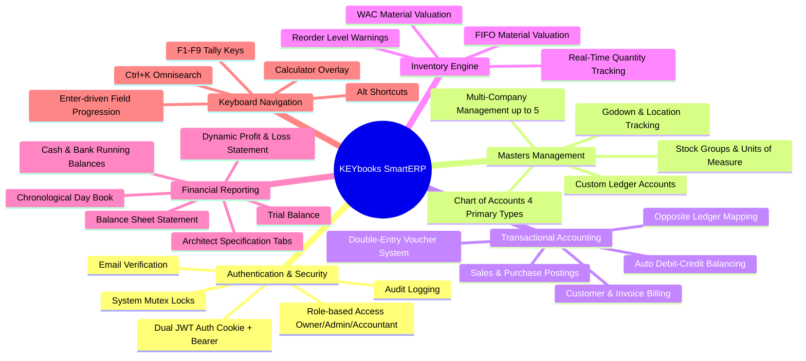
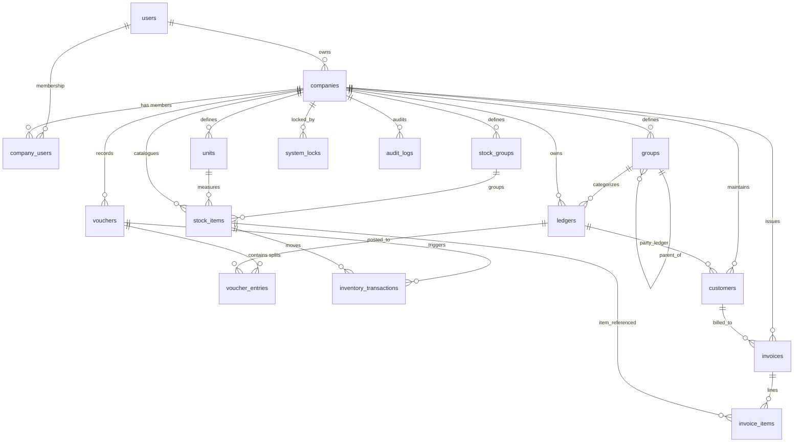

# KEYbooks (SmartERP) — Architecture, Feature Breakdown & Technical Documentation

---

## 1. Executive Summary

**KEYbooks (SmartERP)** is a keyboard-driven, full-stack financial enterprise resource planning (ERP) system designed to bridge the gap between traditional desktop accounting software (such as **Tally Prime**) and modern cloud-native web applications (such as **Zoho Books** and **QuickBooks**). 

Built as an academic and internship capstone project by **Antra Sharma**, KEYbooks delivers a zero-mouse bookkeeping experience directly in the browser. It combines rigorous **double-entry bookkeeping validation**, **FIFO/Weighted Average Cost (WAC) inventory valuation**, **real-time financial statement generation** (Trial Balance, Profit & Loss, Balance Sheet), and **multi-user mutex write locks** to simulate an enterprise-grade ERP architecture.

---

## 2. Core Purpose & Problem Statement

### 2.1 The Problem with Existing Financial Softwares
Traditional accounting workflows present two opposing extremes:
1. **Desktop Legacy Systems (e.g., Tally Prime):**
   - **Strengths:** Lightning-fast keyboard-only entry; accounting clerks can post hundreds of vouchers per day without touching a mouse.
   - **Weaknesses:** Monolithic local database files, challenging remote accessibility, lack of cloud collaboration, rigid desktop-bound installation, and dated interfaces.
2. **Modern Cloud SaaS (e.g., QuickBooks Online, Zoho Books):**
   - **Strengths:** Accessible anywhere via web browser, responsive UI, cloud backups, multi-user role management.
   - **Weaknesses:** Mouse-heavy point-and-click forms that slow down skilled data-entry clerks; heavy form validations that interrupt batch entry rhythms; delayed report updates relying on background caching.

### 2.2 KEYbooks' Solution
KEYbooks harmonizes these two worlds:
- **Web-native, accessible from any browser** with modern React/Next.js and Express/PostgreSQL.
- **Strict keyboard-first design philosophy**: Function keys (`F1`–`F9`), `Alt` hotkeys, `Ctrl+K` omnisearch, and `Enter`/`Arrow` sequential field navigation.
- **Double-entry mathematical integrity**: Atomic transactions guarantee that transactions cannot commit if $\sum \text{Debits} \ne \sum \text{Credits}$.
- **Educational & Architectural Transparency**: Built-in "Systems Architect Specifications" embedded directly into reporting screens, revealing the underlying SQL aggregations, schema foreign keys, and API contracts.

---

## 3. System Architecture & Tech Stack

### 3.1 Technology Stack Details

| Layer | Technology | Key Details | Primary Responsibility |
| :--- | :--- | :--- | :--- |
| **Frontend Framework** | **Next.js** | 15.x (App Router, Turbopack) | Server-side rendering, client hydration, route layouts |
| **Client Core** | **React** | 19.x, TypeScript | State management, component tree, modal lifecycle |
| **Styling & Design** | **Tailwind CSS** | 4.x + Vanilla CSS Variables | Dark/Light mode tokens, micro-animations, responsive layout |
| **Icons & Animation** | **Lucide React** + **Lenis** | Lucide icons, Lenis smooth scroll | Visual indicators, landing page physics |
| **Backend Framework** | **Express.js** | 5.x, Node.js 18+ | REST API endpoints, routing, middleware orchestration |
| **Database** | **PostgreSQL** | 14+ (`pg` connection pool) | Relational integrity, ACID transactions, check constraints |
| **Security & Auth** | **JWT**, **Bcrypt**, **Helmet** | Dual auth (Cookie + Bearer), 12 salt rounds | Session tokens, password hashing, security headers |
| **Mailing Service** | **Nodemailer** | SMTP integration | Account verification, password reset links |

---

## 4. Key Functional Modules & What the Project Has

### 4.1 Multi-Company Workspace Management
- Single account handles up to **5 distinct legal entities** or subsidiary companies.
- Distinct financial years (e.g., `2026-04-01` to `2027-03-31`), localized currencies (`₹`, `$`, `€`, `£`), and GSTINs.
- Rapid switching via keyboard digits `[1]` to `[5]` or Arrow keys.

### 4.2 Chart of Accounts (COA) & Ledger Hierarchy
- Hierarchical structure with 4 top-level standard accounting types:
  1. **Assets** (Debit normal balance)
  2. **Liabilities** (Credit normal balance)
  3. **Income** (Credit normal balance)
  4. **Expenses** (Debit normal balance)
- Unlimited sub-groups and custom ledgers with opening balance allocations (`Dr` / `Cr`).
- Protected against accidental deletion via database foreign key `ON DELETE RESTRICT` constraints if vouchers reference the ledger.

### 4.3 Double-Entry Voucher Engine
- Supports key voucher types: **Payment**, **Receipt**, **Journal**, **Sales**, and **Purchase**.
- **Real-Time Debit/Credit Enforcer**: Before writing to the database, the system verifies:
  $$\sum \text{Debit Amounts} - \sum \text{Credit Amounts} = 0$$
- Atomic database transactions (`BEGIN ... COMMIT / ROLLBACK`): If any entry fails, the entire voucher is rolled back.

### 4.4 Advanced Inventory Management (FIFO & WAC)
- Unit of Measurement (UOM) definitions (e.g., `NOS`, `KGS`, `BOX`, `PCS`).
- Stock items with SKU, HSN codes, GST percentage, reorder thresholds, and valuation choice:
  - **FIFO (First-In, First-Out)**: Inbound purchase batches are recorded with timestamped costs and matched sequentially against outbound transactions.
  - **WAC (Weighted Average Cost)**: Continuous re-calculation of weighted average price:
    $$\text{Average Rate} = \frac{\text{Prior Value} + \text{Inbound Cost}}{\text{Prior Qty} + \text{Inbound Qty}}$$
- Real-time stock alerts trigger when current balance dips beneath defined `reorder_level`.

### 4.5 Dynamic Live Financial Statements
No scheduled nightly cron jobs or cached summaries:
1. **Trial Balance**: Aggregates net debit and net credit postings across all active ledgers, demonstrating mathematical balance.
2. **Profit & Loss Account**: Dynamically groups direct/indirect expenses against operational/other revenues to yield Gross and Net Profit.
3. **Balance Sheet**: Compiles cumulative Assets against Capital & Liabilities to show business net worth as of a chosen date.
4. **Cash / Bank Book**: Chronological running balance of bank accounts and cash drawers.
5. **Day Book**: Global daily transaction audit register with one-click drill-downs into double-entry splits.

### 4.6 Concurrency Protection & Safety Locks
- **`system_locks` Mutex Mechanism**: When an authorized user accesses or alters critical configuration (tax matrices, invoice numbering prefixes, company fiscal parameters), a lock is acquired in the database.
- Other active users are prevented from making conflicting mutations until the lock expires or is released, preventing database race conditions.
- **Audit Logging (`audit_logs`)**: Automatically records the initiating user, affected table, operation, record ID, and JSON snapshots of altered data.

---

## 5. Keyboard Navigation Architecture

KEYbooks replicates the speed of desktop bookkeeping via a unified keyboard hook (`useKeyboardShortcuts.ts`) and context (`ShortcutContext.tsx`):

| Hotkey | Action | Description |
| :--- | :--- | :--- |
| `F1` | **Help / Shortcuts Modal** | Opens full cheat-sheet overlay displaying all available shortcuts |
| `F2` | **Fiscal Period** | Quick-selects active Financial Year start and end dates |
| `F3` | **Company Info** | Opens company information drawer and entity properties |
| `F8` | **Sales Voucher** | Directly routes to Sales Invoice / Sales Voucher creation |
| `F9` | **Purchase Voucher** | Directly routes to Purchase Voucher / Inward Stock registration |
| `Ctrl + K` / `Cmd + K` | **Command Palette** | Global search across screens, vouchers, ledgers, and reports |
| `Alt + C` | **Calculator** | Toggles a floating calculator overlay with instant memory recall |
| `Alt + L` | **Ledgers** | Quick jump to Chart of Accounts and Ledger management |
| `Alt + G` | **Groups** | Quick jump to Account Group hierarchies |
| `Alt + S` | **Stock Items** | Quick jump to Stock Item Catalog & Godown registers |
| `Alt + V` | **Voucher Gateway** | Quick jump to general voucher entry screen |
| `Esc` | **Back / Gateway** | Closes active modals; from a master page, navigates up to Dashboard |
| `Enter` / `Down Arrow` | **Next Input Field** | Advances focus to the subsequent form field without mouse clicking |
| `Ctrl + Enter` | **Submit / Post** | Commits and saves the current form or voucher |

---

## 6. Detailed Comparison: KEYbooks vs. Other Financial Software

| Capability / Dimension | **KEYbooks (SmartERP)** | **Tally Prime** | **QuickBooks Online** | **Zoho Books** |
| :--- | :--- | :--- | :--- | :--- |
| **Deployment & Platform** | Modern Web (Next.js + Express) | Windows Desktop Executable | Cloud SaaS | Cloud SaaS |
| **Keyboard Ergonomics** | **First-class native web keys** (`F1`–`F9`, `Alt`, `Enter`) | **Gold standard desktop** keyboard shortcuts | Limited (basic `Ctrl+Alt` browser keys) | Limited mouse-centric web UI |
| **Double-Entry Enforcing** | Strict $\Delta=0$ atomic check | Strict balance check | Auto-balanced hidden journals | Auto-balanced hidden journals |
| **Stock Valuation Methods** | Real-time **FIFO & WAC** selectable | Multi-method (FIFO, LIFO, WAC, Std Cost) | FIFO only (Advanced tiers) | FIFO only |
| **Concurrency Locking** | **Explicit Mutex Locks** (`system_locks`) | File-level locking / Tally.NET | Optimistic row locking | Optimistic locking |
| **System Inspectability** | **Live "Architect Specs"** in UI (SQL & schema) | Proprietary TDL (closed engine) | Proprietary closed API | Proprietary closed API |
| **Authentication Flow** | Dual: **HTTP-only Cookie + Bearer Token** | Windows user / Tally Vault | OAuth 2.0 / SSO | OAuth 2.0 / SSO |
| **Database Engine** | Standard Relational **PostgreSQL** | Proprietary Flat-File DB (`.900`) | Proprietary Cloud DB | Proprietary Cloud DB |
| **Installation Overhead** | Zero-install web client | Local setup + license server | Zero-install web client | Zero-install web client |
| **Extensibility & Audit** | Full SQL access + `audit_logs` table | TDL scripts | App marketplace | Deluge scripts & Zoho flow |

---

## 7. Database Entity Relationship Diagram (ERD)

---

## 8. Summary of Technical Innovations in KEYbooks

1. **Dual-Layered Resilient Authentication:**
   Both HTTP-only Cookies (with `SameSite=Lax` for development compatibility) and `Authorization: Bearer <token>` headers are supported concurrently, making the application immune to third-party cookie restrictions or cross-port issues.
2. **Transparent "Systems Architect" Mode:**
   Allows students, auditors, and senior engineers to view the raw parameterized SQL queries, execution latency, and JSON payloads generating their financial reports directly in the user interface.
3. **True Transactional Consistency:**
   Leverages PostgreSQL ACID transactions with `ON DELETE RESTRICT` foreign keys, preventing orphan ledger records or out-of-balance journal entries.
4. **Desktop Speed with Web Convenience:**
   Implements an event-driven hotkey listener pattern that bypasses typical browser focus traps, enabling clerks to execute complete voucher posting lifecycles using only their keyboard.
